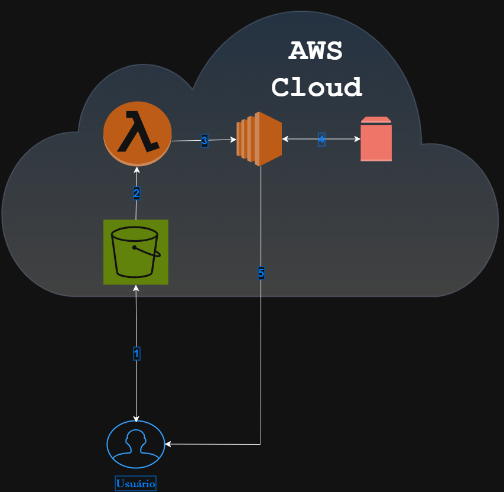

Desafio DIO - Santander Code Girls

Neste desafio, criamos uma arquitetura no *Draw.io* para consolidar nosso conhecimento em gerenciamento de instâncias *EC2 na AWS*.

O objetivo era projetar uma arquitetura simples utilizando os seguintes serviços:

---

## ☁️ Serviços Utilizados

-   
  Serviço de armazenamento de objetos, usado para guardar arquivos (imagens, vídeos, documentos etc).  
  No fluxo, é o ponto inicial onde o usuário envia os arquivos.

-   
  Serviço serverless que executa funções automaticamente em resposta a eventos.  
  No fluxo, é acionado quando um novo arquivo chega ao S3.

-   
  Serviço de máquinas virtuais (IaaS) na AWS, onde podemos rodar aplicações, bancos de dados e APIs.  
  No fluxo, recebe o processamento iniciado pelo Lambda.

-   
  Armazenamento em bloco anexado ao EC2, funcionando como um HD/SSD persistente para guardar dados.  

---

## 🔄 Fluxo de Funcionamento

1. O *usuário* envia um arquivo para o *Amazon S3*.  
2. O *S3* dispara um evento que aciona a função *AWS Lambda*.  
3. O *Lambda* processa o evento e aciona a instância *Amazon EC2*.  
4. A instância *EC2* se conecta ao *Amazon EBS* para armazenar e manipular dados.  
5. O resultado do processamento é devolvido ao *usuário*.  

---

## 🖼️ Arquitetura Criada

> Diagrama elaborado no *Draw.io*  

---

## ✨ Conclusão

Este desafio ajudou a entender como os serviços da AWS podem ser integrados para criar uma solução completa:  
- *S3* para armazenamento,  
- *Lambda* para processamento automático,  
- *EC2 + EBS* para execução e persistência de dados,  
- *Usuário* interagindo com todo o fluxo.
